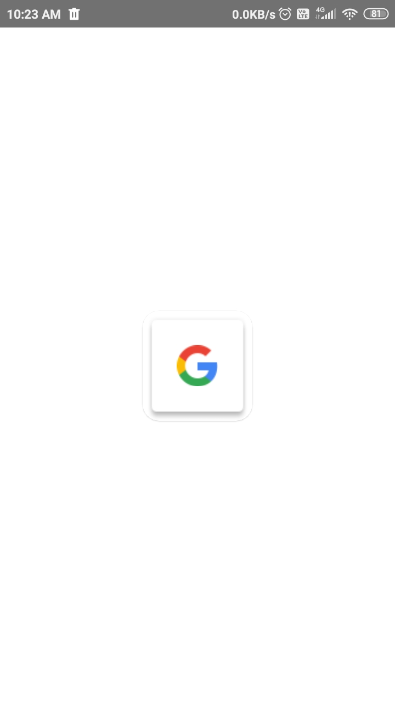
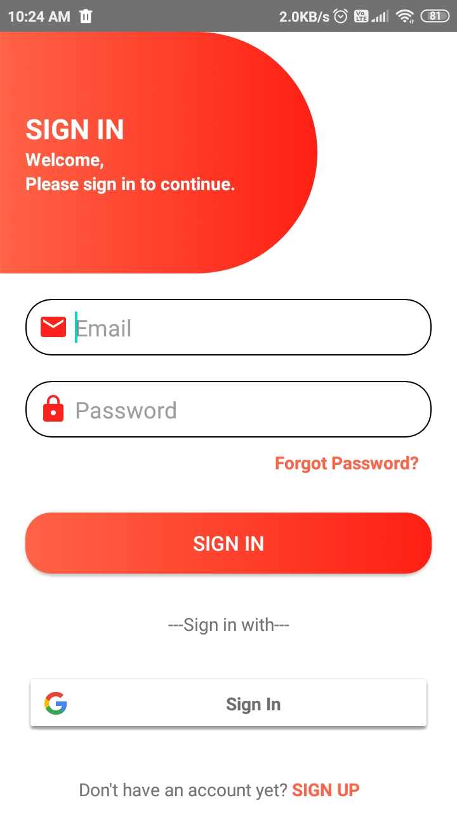
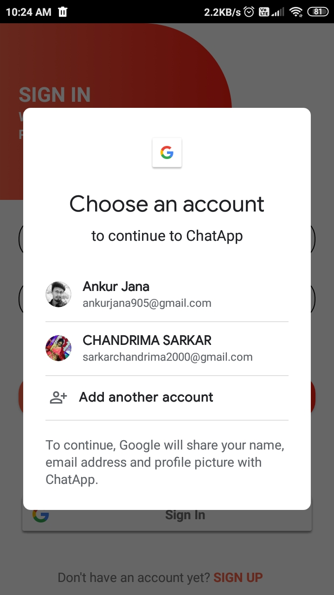
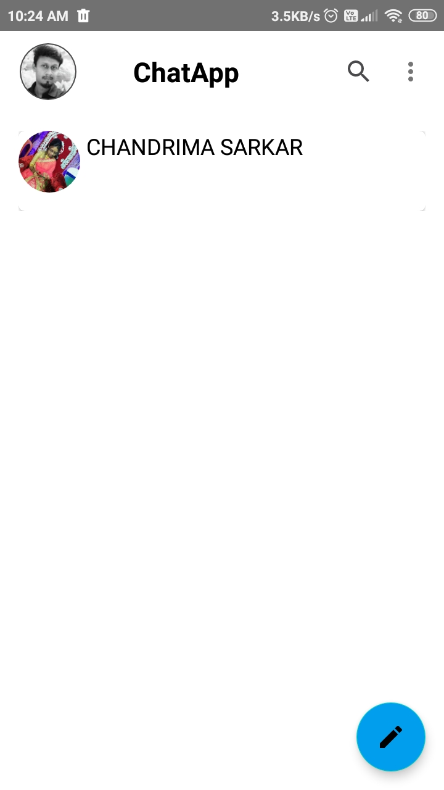
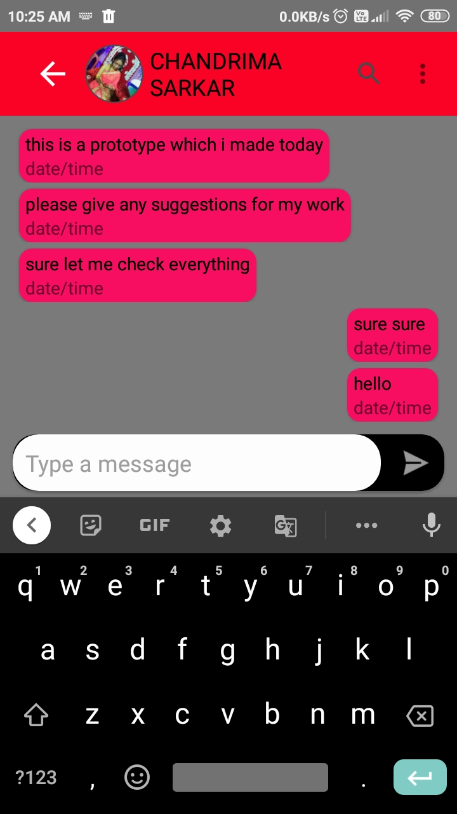
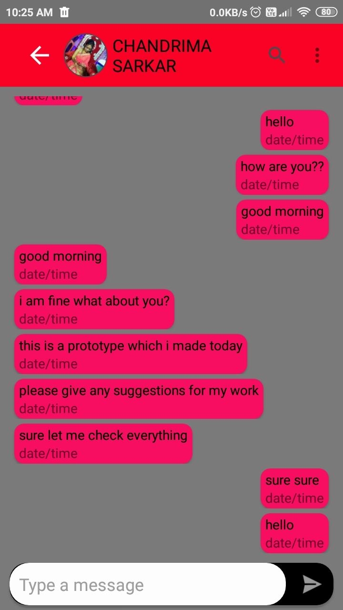
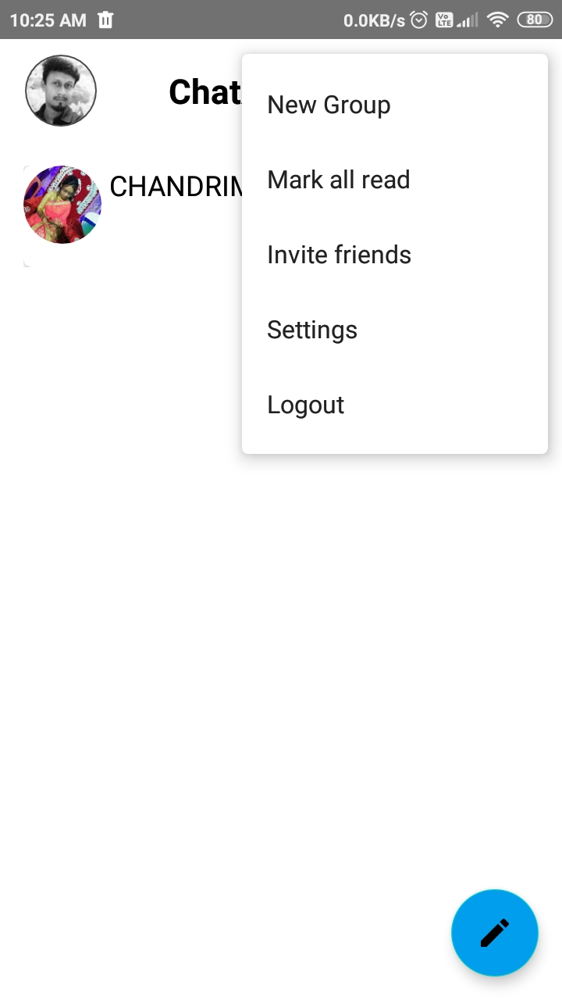

# ChatApp

This is a chat app made by using firebase google auth and firebase realtime database

Component Use :
1) Firebase Google Auth
2) Fire Base realtime database
3) Constrain Layout
4) RecyclerView
5) Glide Image Library 
6) Circuler Image View

